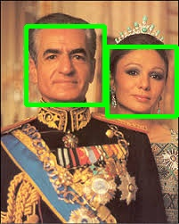

# real-time-face-detection-opencv
A practical Computer Vision project for detecting faces in images and webcam video using Python and OpenCV.
# Real-Time Face Detection with OpenCV

This is a practical Computer Vision project using Python and OpenCV.

## Project Overview

This project demonstrates face detection using OpenCV and a Haar Cascade classifier.

The project starts with face detection in a static image and then extends to real-time face detection using a webcam.

The goal of this project is to practice object detection basics and understand how bounding boxes are used to identify faces in images and video streams.

## Features

- Read and display an image
- Convert an image to grayscale
- Detect faces using Haar Cascade
- Draw bounding boxes around detected faces
- Save the detected face image
- Perform real-time face detection using a webcam

## Technologies

- Python
- OpenCV
- Haar Cascade Classifier

## Project Structure
real-time-face-detection-opencv/
│
├── images/
│   ├── face.jpg
│   └── face_detected.jpg
│
├── 1_face_detection_image.py
├── 2_face_detection_webcam.py
├── requirements.txt
└── README.md

## How to Run

First, install the required package:
pip install -r requirements.txt

Run face detection on an image:
python 1_face_detection_image.py

Run real-time face detection with webcam:
python 2_face_detection_webcam.py

To stop the webcam window, press:
q

## Output Example

### Original Image

### Face Detection Result

## What I Learned

Through this project, I practiced:

- Loading and processing images with OpenCV
- Converting images to grayscale
- Using a Haar Cascade classifier for face detection
- Drawing bounding boxes around detected faces
- Saving processed images
- Working with real-time webcam input
- Building a structured Computer Vision project for GitHub

## Purpose

The purpose of this project is to continue building a practical Computer Vision portfolio with Python and OpenCV.

This project is a step toward real-world computer vision applications such as face detection, object detection, and video analysis.
